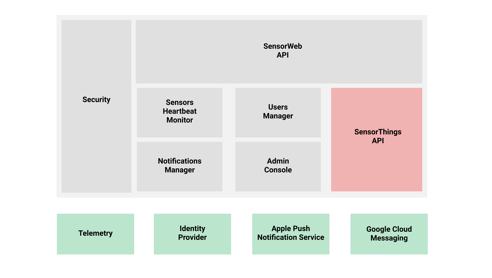

# SensorWeb cloud service(s)
## High level architecture

## Components
### SensorWeb API
Public REST API to be consumed by Mozilla's SensorWeb client apps and sensor stations and potentially by other 3rd party apps and associated devices.

The WIP documentation for this API can be found [here](https://github.com/mozilla-sensorweb/sensorweb-server/blob/master/doc/API.md).

### SensorThings API
The [SensorThings API](http://docs.opengeospatial.org/is/15-078r6/15-078r6.html) is an [OGC](http://www.opengeospatial.org/) standard specification for providing an open and unified way to interconnect IoT devices, data, and applications over the Web. This is the core piece of SensorWeb in charge of managing the list of registered sensors and its data. We will be working on our own open source implementation of this API. While we work on it, we will use [SensorUp](http://www.sensorup.com/)'s sandbox to unblock the development of other SensorWeb components.

### Notifications Manager
We need to send push notifications to different client platforms. The targets are iOS and Android so far, but in the future we may also want to add web clients as target for push notifications. The Notifications Manager component abstracts the usage of the Apple Push Notification Service and the Google Cloud Messaging service.

### Sensors Heartbeat Monitor
This component is in charge of identifying scenarios where a sensor station loses connection or starts malfunctioning. In this situation we are required to send a notification to the owner of the failing sensor station. For example, to detect that a sensor lost its connection to the server this component can periodically query the database through the SensorThings API looking for active sensors that have not pushed new observations for the last X seconds or minutes.

### Users Manager
Each SensorWeb API client will have its own list of users manage through this component. User authentication will be done through a external Identity Provider (still TBD).

### Admin Console
Frontend to manage things like API credentials and users. The code for this component lives [here](https://github.com/mozilla-sensorweb/sensorweb-admin-panel).

## External components
### Telemetry
TBD. We will probably reuse the [work done for Firefox OS](https://wiki.mozilla.org/Gaia/Metrics)

### Identity Provider
TBD. We will probably use [Firefox Accounts](https://developer.mozilla.org/en-US/docs/Mozilla/Tech/Firefox_Accounts).

### Apple Push Notification Service
[Apple Notifications](https://developer.apple.com/notifications/)

### Google Cloud Messaging
[GCM](https://developers.google.com/cloud-messaging/)

## Storage
[Crate.io](https://crate.io/)

## Security
The API security is based on API keys and API secrets, bearer tokens, token scopes and the usage of HTTPS.

Clients that require read-write access to the sensors management API need to request a new API key and secret and keep them in a secure location. With these credentials clients are able to generate a one-time and short-lived (i.e. 60 seconds) signed JSON Web Tokens (JWT) with a scope limited to register and unregister sensors.

With each new registration a sensor gets a unique ID and a new JWT with no expiration, signed with a server side secret and with a scope limited to the creation of new sensor observations for the assigned sensor ID.

Sensors can be registered anonymously or tied to a user account. In the later case, the use of an external Identity Provider (IdP) is required to avoid managing user passwords. The IdP choice is still TBD. IdP assertions (likely Oauth tokens) are exchanged by JWTs with limited TTL (i.e. 30 days) and a scope limited to query and manage the list of sensors tied to the user account.

### Security (& privacy) Risks & Mitigations

#### 1. Leaked API secret.
Even if the client developer do its best to protect API secrets, a highly motivated hacker can always get to them in an installed app. So the first mitigation here is to limit what an attacker can get from stealing an API secret. The value of the client secret is impersonating the application, but all that it gives access to is to register new sensors. Unregistering sensors requires the API secret and the sensor bearer token that is unique for that sensor. With an API secret you are never given access to any private user data.

API keys/secrets can be revoked at any time in cases where abuse of the API is encountered or we notice that API credentials are leaked.

#### 2. Leaked user session token.

In order to mitigate the risk of stolen user credentials we can optionally require a second factor authentication step during the login process.

We can also build a notification system to let the user know when and where a login happens and a way to remotely terminate sessions and revoke session tokens.

#### 3. Leaked sensor token.

The main mitigation in the case of a leaked sensor token is again to limit what an attacker can get from stealing this kind of token. The value of the sensor token is impersonating the sensor. With a stolen token an attacker can create fake requests in the name of the affected sensor, but in any case it can fake requests for other sensors. So the damage is limited to one specific sensor.

#### 4. Man-in-the-middle.

Because the security for sensors and user requests relies on bearer tokens that are sent over the wire, we are at risk of leaking these tokens in the event of a man-in-the-middle attack.

The main mitigation here is the usage of HTTPS for all communications.

#### 5. Privacy issues storing user locations.

Sensors can be registered anonymously or tied to a user account. In the later case, because we store the coordinates of the sensor location, (A) we should not expose publicly a match between a sensor ID and a user ID (email). And (B) we should not even store that kind of information in clear in our data store.

(A) is ensured by requiring a bearer token with user scope containing the user id that has to match the id of the owner. A user is only be able to see the data they own and nothing else.

(B) Is a bit harder. One way to protect the privacy of the user in this case is to follow the same pattern that we have on Firefox Sync by implementing the onepw protocol as described at [https://github.com/mozilla/fxa-auth-server/wiki/onepw-protocol](https://github.com/mozilla/fxa-auth-server/wiki/onepw-protocol). In summary this protocol allow us to encrypt the data on the client with a pair of keys that only the user can obtain (through a derivation of his password) before sending it to our servers.
